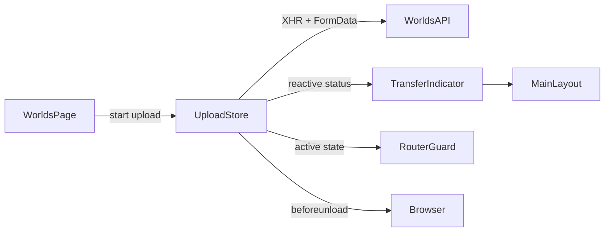

# Requirements

### Overview & Goals

Provide a persistent, app-level status display while a large world archive is uploading and being imported, and prevent accidental navigation from abandoning that active request.

### In Scope

- One active world upload at a time.
- Persistent authenticated-layout indicator with filename, transferred/total bytes, percentage, elapsed time, and phase.
- Accurate `Uploading` progress from browser `XMLHttpRequest.upload` events; after the bytes reach the server, display `Processing world` until the existing request completes.
- Confirmation before internal SPA navigation and browser-native warning for reload, close, or external navigation while the transfer is active.
- The Worlds page refreshes its library list and shows the existing success/error notifications when the shared upload resolves.

### Out of Scope

- Reload/reconnect-resilient uploads or server-side job persistence.
- Extraction/packing percentage or distinct server-side phases; the current `POST /api/worlds/upload` response is synchronous and does not stream progress.
- Concurrent uploads or cancellation controls.

# Technical Design

### Current Implementation

- `frontend/src/pages/WorldsPage.vue` owns selection and calls `worldsApi.upload(file)`, so all state disappears when the page unmounts.
- `frontend/src/api/worlds.ts` performs that upload with `fetch`, which cannot report request-body upload bytes.
- `frontend/src/layouts/MainLayout.vue` persists around authenticated route changes and is the appropriate host for a compact global status UI.
- `frontend/src/router/index.ts` already uses a global `beforeEach` guard; `frontend/src/stores/servers.ts` demonstrates the project’s typed Pinia store/action pattern.
- `backend/src/worlds/worlds.controller.ts` accepts the archive then awaits `WorldLibraryService.importArchive`; the latter’s `onProgress` callbacks are internal only. This plan keeps that API unchanged.

### Proposed Changes

- Add `frontend/src/stores/world-upload.ts` as the single source of truth for one active upload: `idle`, `uploading`, `processing`, `succeeded`, and `failed` state; filename; byte counts; progress; start time; and error/result.
- Implement the store’s upload action with `XMLHttpRequest` to `POST /api/worlds/upload`, `FormData`, `withCredentials = true`, and `xhr.upload.onprogress`. Parse the existing JSON envelope and surface response errors in the same style as `ApiError`/`worldsApi.upload`.
- Transition from `uploading` to `processing` when all bytes have been transmitted while retaining the request until its final response arrives. The store will expose derived values for `active`, percentage, and elapsed time for the UI and guards.
- Update `WorldsPage.vue` to start the store action, disable the upload trigger while active, and retain responsibility for success/error notifications and `load()` after a successful completed import.
- Add a small Quasar-based indicator component, mounted from `MainLayout.vue`, rendered for active or terminal transfer state. It will show phase, filename, determinate progress/byte details during upload, and elapsed time, with a dismissible completed/error result after completion.
- Extend `router/index.ts`’s global guard to show a Quasar confirmation dialog when an active upload/processing request would be left. Allow navigation only after confirmation; otherwise cancel it.
- Register and clean up a `window.beforeunload` handler from the transfer store or layout lifecycle, setting `event.returnValue` only while active. Browser-controlled wording will be used for this native prompt.

### Data Flow

### Constraints

- Use relative `/api/worlds/upload` and cookie credentials, matching `frontend/src/api/http.ts`.
- Do not alter the `20 GiB` backend limit, temporary-file behavior, archive validation, or `WorldLibraryService` import process.

# Testing

### Validation Approach

- Run `npm run lint:check`, `npm run typecheck`, and `npm run build` in `frontend/`.
- Manually exercise the UI with a sufficiently large archive or throttled network to inspect ongoing upload state.

### Key Scenarios

- Selecting a world starts one XHR request; the indicator is visible outside `/worlds`, reports transferred bytes/percent, and the page blocks another selection while active.
- When upload bytes complete but the HTTP request remains pending, the indicator changes to `Processing world`; success refreshes the world library and failure shows the returned error.
- A drawer/header route click during upload or processing opens a confirmation; cancel preserves the route and confirm proceeds.
- Reloading, closing, or navigating to another origin during active transfer invokes the browser-native unload warning; no warning appears once the request settles.
- Completed or failed status can be dismissed and does not prevent later uploads.

# Delivery Steps

### ✓ Step 1: Implement shared XHR upload state in a Pinia store

A typed `world-upload` Pinia store can start and track exactly one active world transfer.

- Add `frontend/src/stores/world-upload.ts` with typed phases, transfer metadata, derived progress/elapsed values, and reset/dismiss behavior.
- Send the existing multipart request via credentialed `XMLHttpRequest` to preserve the current backend contract while capturing `xhr.upload` byte events.
- Parse the existing `{ ok, world }` response and move from `Uploading` to generic `Processing world` after client bytes finish but before the synchronous import response returns.
- Reject a second start while a transfer is active and retain success/error state for the caller and persistent UI.

### ✓ Step 2: Connect world selection and persistent transfer feedback

World uploads can be started on the Worlds page while their status remains visible throughout the authenticated application.

- Update `frontend/src/pages/WorldsPage.vue` to delegate upload start to the new store, disable its upload action during an active transfer, and preserve list-refresh and notification behavior on settlement.
- Add a focused Quasar transfer-status component under `frontend/src/components/` that renders filename, phase, transferred/total bytes, progress, elapsed time, and a dismissible terminal result.
- Mount the component in `frontend/src/layouts/MainLayout.vue` so it outlives `router-view` page changes and maintains access to the store.

### ✓ Step 3: Guard SPA and browser navigation during active transfers

Active world uploads and server-side processing prompt before users can accidentally navigate away.

- Extend `frontend/src/router/index.ts` to consult the transfer store in its existing global `beforeEach` flow and present a confirmation before allowing an active transfer to be left.
- Register a `beforeunload` listener at the persistent layout/store boundary that sets the standard browser prompt signal only while the transfer state is active.
- Ensure guard state is cleared when the request succeeds or fails, and validate route cancellation, confirmed departure, reload protection, and post-completion navigation alongside frontend lint, typecheck, and build gates.
